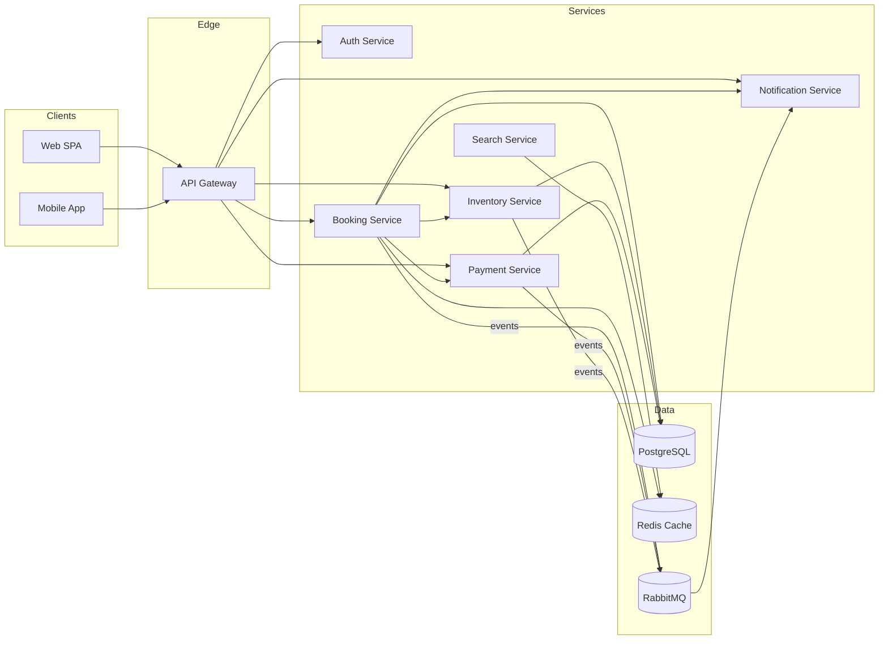
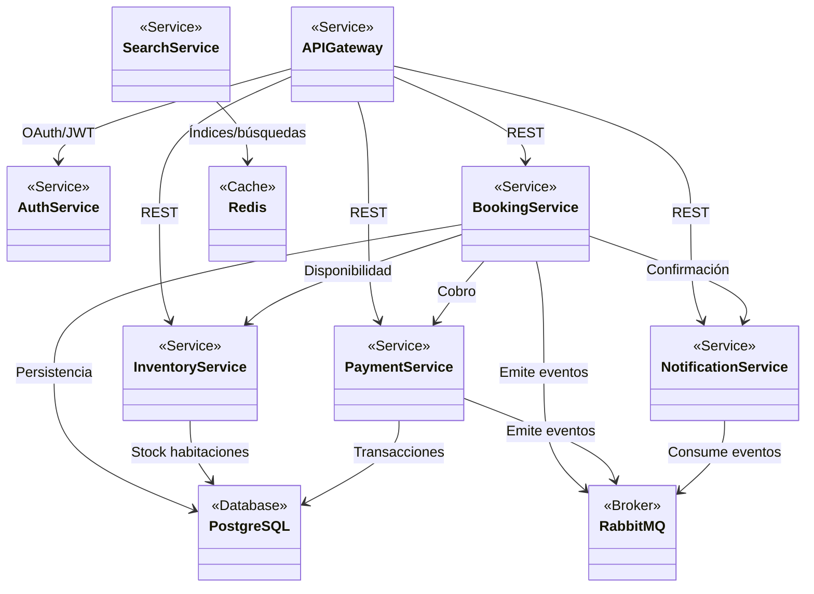
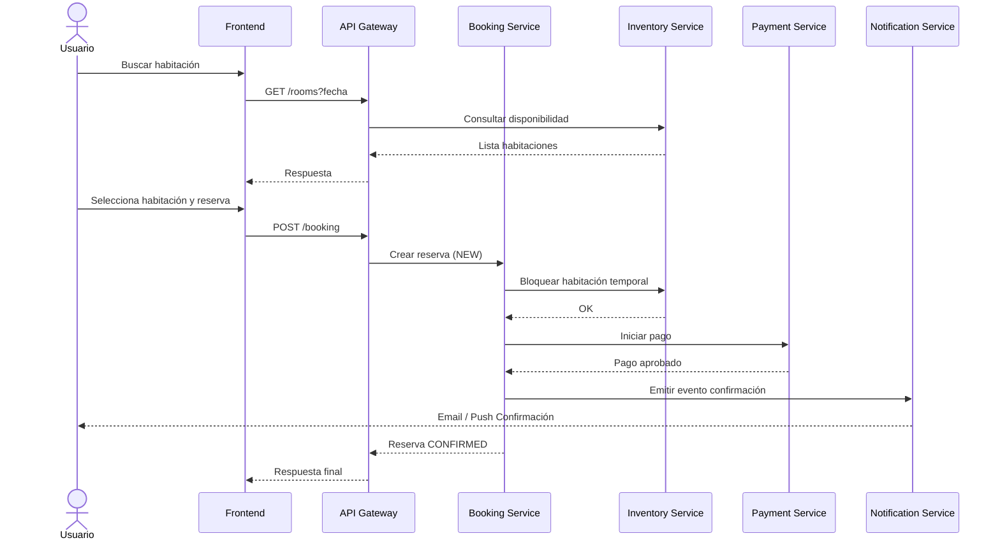
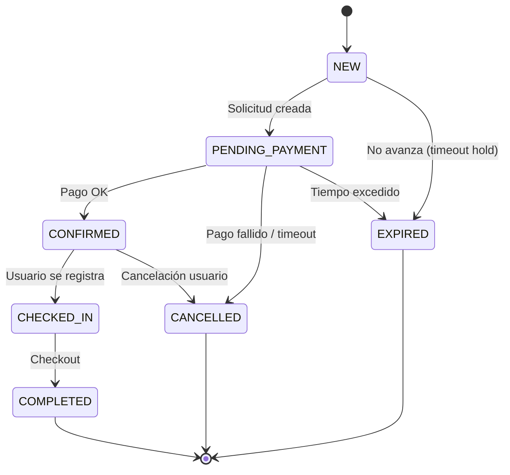
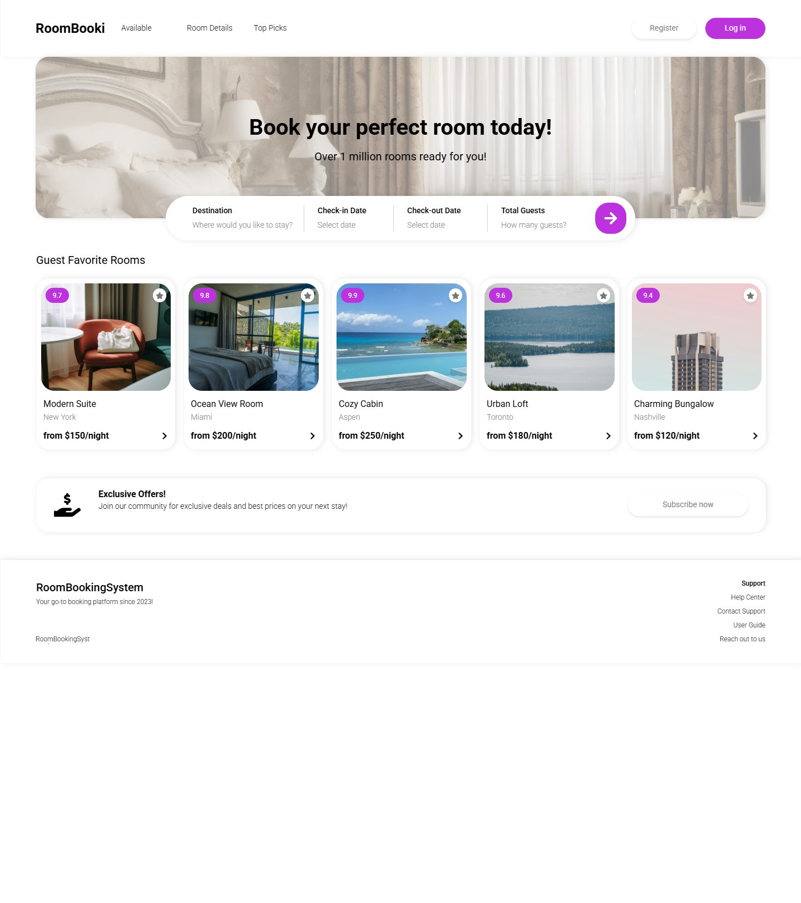

# ✅ Solución (POC en Java + Diagramas Mermaid)

## 1. Introducción
Este documento presenta el diseño conceptual y una prueba de concepto (POC) mínima de un sistema de reservación de habitaciones basado en microservicios. El objetivo es ilustrar la arquitectura, componentes clave, flujo de interacción durante una reserva y el ciclo de vida de una entidad `Reserva`.

Se implementa un POC en Java (Spring Boot) con servicios mínimos: `api-gateway`, `booking-service`, `inventory-service`, `payment-service`, `notification-service`, `auth-service`. Solo `booking-service` tiene lógica de dominio simplificada (gestión de reservas en memoria). Los demás servicios son esqueletos para representar separación de responsabilidades.

## 2. Diagrama de Arquitectura (Alto Nivel)

## 3. Diagrama UML de Componentes
Representado como componentes y dependencias básicas.

## 4. Diagrama de Secuencia (Proceso de Reserva)

## 5. Diagrama de Estado (Reserva)

## 6. Capturas UI (Estructura)

[Link to the designs](https://app.uizard.io/p/a1b4f285)

### UI Screenshots

## 7. Tecnologías y Justificación
- **Spring Boot**: Rapidez para exponer REST y empaquetar microservicios independientes.
- **API Gateway**: Punto único de entrada (seguridad, routing, rate limiting futuro).
- **Separación de servicios**: Facilita escalado independiente y aislar responsabilidades.